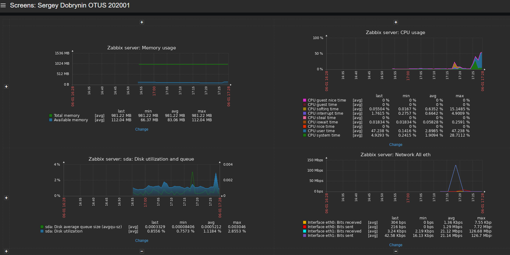
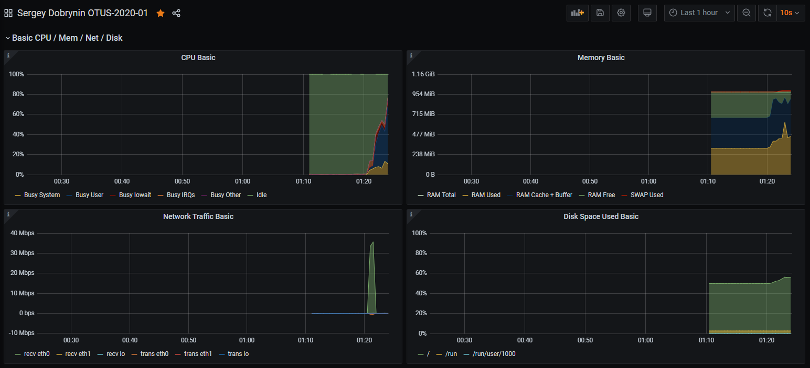
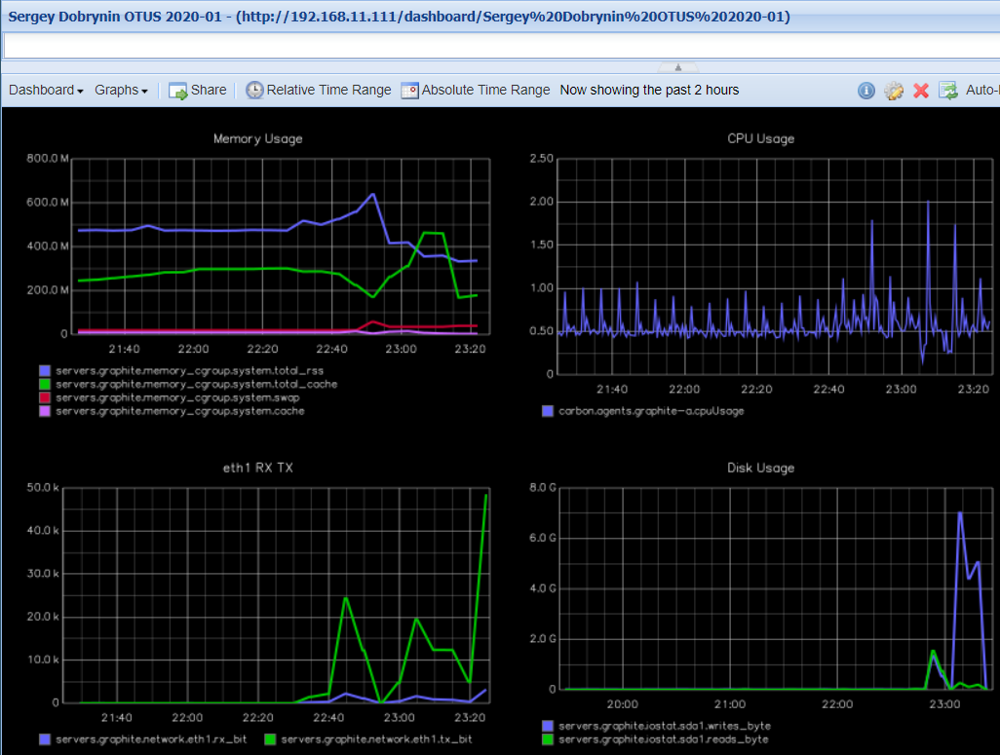

# Мониторинг и алертинг

## Задачи

### Настроить дашборд с 4-мя графиками
1. память
2. процессор
3. диск
4. сеть

Так как ранее не использовал Prometheus, то было интересно попробовать его. Так же интересно было посмотреть новую версию Zabbix, поэтому из двух альтернатив выбрал обе.

В качестве дополнительной задачи развернул мониторинг на основе graphite:

